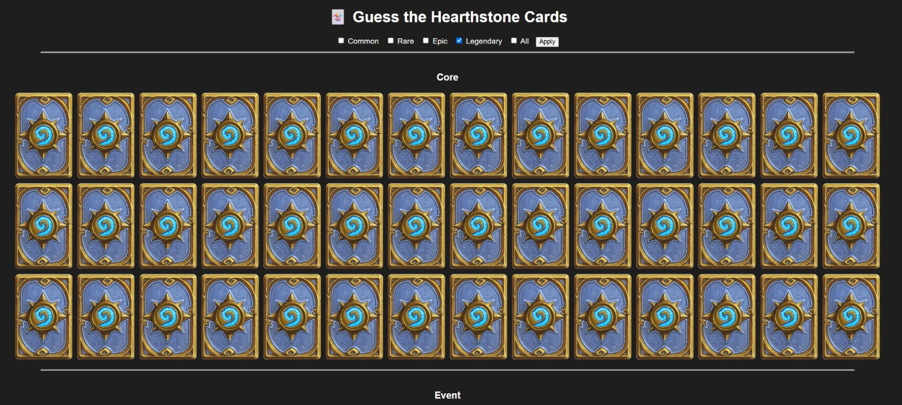

# 🃏 Hearthstone Memory & Guessing Game

This project is a Hearthstone-themed memory and card-guessing game that uses real card data from Blizzard's Hearthstone API via RapidAPI.  
It features:
- A Flask web interface where players guess card names.
- Animated flip card UI with rarity filtering and set grouping.
- A desktop Tkinter version for offline play.

---

## 🚀 How to Run

### 1. Clone the project

Make sure all files are in the same folder, including:
- `flask_app.py`
- `main.py` (Tkinter game)
- `memory_ui.py` (alternative memory view)
- `trie.py`
- `requirements.txt`
- `static/└── card_back.png`

### 2. Install dependencies

```bash
pip install -r requirements.txt
```

### 3. Run the Flask app

```bash
python flask_app.py
```

Then, open your browser and go to:

👉 [http://localhost:5000/cards](http://localhost:5000/cards)

Here, you'll see:
- All current **Standard** cards from Blizzard sets.
- Filtering by **rarity** (Common, Rare, Epic, Legendary).
- Guessing input: type a card name to flip it.

---

## 🏆 Game Objective

Your goal is to **guess and flip all the visible cards** by typing their names correctly.  
Once all cards are revealed, a celebratory message will pop up:  
🎉 “Well done! You guessed all cards!”

---

## 📦 Requirements

- Python 3.8+
- Flask
- Requests
- Pillow

These are automatically installed via the `requirements.txt`.

---

## 💡 Features

- 🔁 Flip animation on correct guess
- 🔎 Guess by name (with Enter key or button)
- 📚 Filter by rarity: Common, Rare, Epic, Legendary, All
- 🪄 Scrolls and animates automatically to reveal found card
- 📦 Full support for Standard sets (e.g. Core, Whizbang’s Workshop)

---

## 🖼️ Screenshots

Here’s what the UI looks like:



---

## 💬 Notes

- Uses real-time data from `omgvamp-hearthstone-v1` API (via RapidAPI)
- Fully supports multiple set sections, visually separated

---

## 📄 License

This project is licensed under the **GPL-3.0 License** – see the [LICENSE](LICENSE) file for details.

---

## 👥 Credits

Made by Urevich Larry and Oran S.Cohen

---

Enjoy and test your Hearthstone card knowledge! 🔍🧠